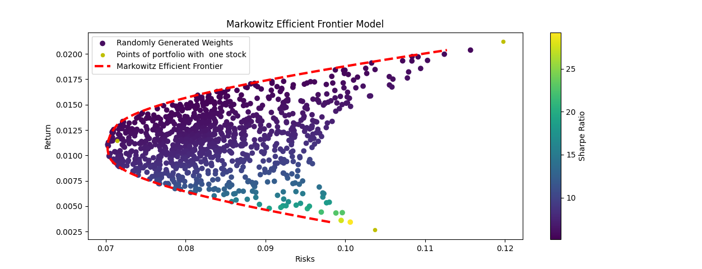
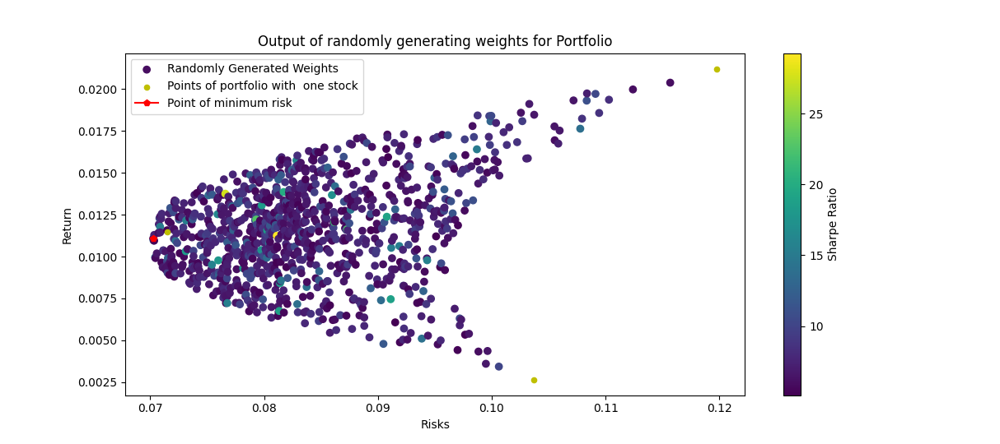
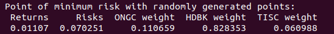
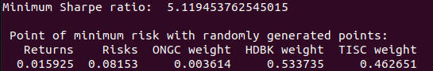
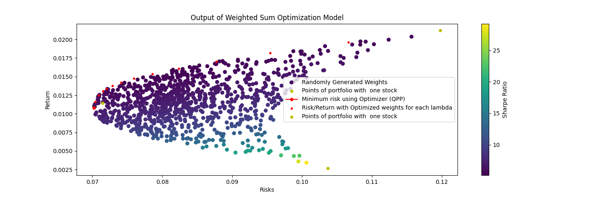
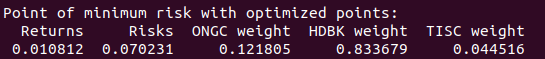
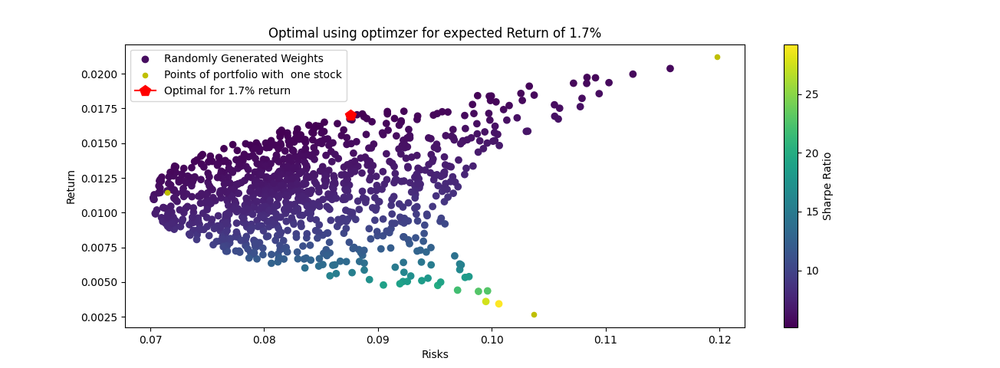
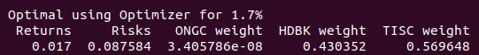

<div id="top"></div>
<!--
*** Thanks for checking out the Best-README-Template. If you have a suggestion
*** that would make this better, please fork the repo and create a pull request
*** or simply open an issue with the tag "enhancement".
*** Don't forget to give the project a star!
*** Thanks again! Now go create something AMAZING! :D
-->


<!-- PROJECT SHIELDS -->
<!--
*** I'm using markdown "reference style" links for readability.
*** Reference links are enclosed in brackets [ ] instead of parentheses ( ).
*** See the bottom of this document for the declaration of the reference variables
*** for contributors-url, forks-url, etc. This is an optional, concise syntax you may use.
*** https://www.markdownguide.org/basic-syntax/#reference-style-links
-->
<!-- [![Contributors][contributors-shield]][contributors-url] -->
<!-- [![Forks][forks-shield]][forks-url] -->
<!-- [![Stargazers][stars-shield]][stars-url] -->
<!-- [![Issues][issues-shield]][issues-url] -->
<!-- [![MIT License][license-shield]][license-url]
[![LinkedIn][linkedin-shield]][linkedin-url] -->


<!-- PROJECT LOGO -->
<br />
<div align="center">
  <!-- <a href="https://github.com/PratikshaJain37/Portfolio-Modelling">
    
  </a> -->

<h1 align="center">Portfolio Modelling</h1>

  <p align="center">
    A collection of algorithms implemented in python to model your portfolio of stocks.
    <br />
    <br />
    <a href="https://github.com/PratikshaJain37/Portfolio-Modelling">View Demo</a>
    ·
    <a href="https://github.com/PratikshaJain37/Portfolio-Modelling/issues">Report Bug</a>
    ·
    <a href="https://github.com/PratikshaJain37/Portfolio-Modelling/issues">Request Feature</a>
  </p>
</div>


<!-- TABLE OF CONTENTS -->
<details>
  <summary>Table of Contents</summary>
  <ol>
    <li>
      <a href="#about-the-project">About The Project</a>
      <ul>
        <li><a href="#built-with">Built With</a></li>
      </ul>
    </li>
    <li>
      <a href="#getting-started">Getting Started</a>
      <ul>
        <li><a href="#prerequisites">Prerequisites</a></li>
        <li><a href="#installation">Installation</a></li>
      </ul>
    </li>
    <li><a href="#usage">Usage</a></li>
    <li><a href="#roadmap">Roadmap</a></li>
    <li><a href="#contributing">Contributing</a></li>
    <li><a href="#license">License</a></li>
    <li><a href="#contact">Contact</a></li>
    <li><a href="#acknowledgments">Acknowledgments</a></li>
  </ol>
</details>


<!-- ABOUT THE PROJECT -->
## About The Project



In the stock market, we are often given a variety of assets, and we have to manage them to get the maximum benefit, knowing their risks and rewards. This project is about modelling portfolios to get one that gives us the optimum return.

An output of the algorithms implemented is shown. 

### Random Weights Model
    

One of the most naive algorithms we implement and learn about is assigning random weights to our stocks and plotting the risk and return graph. We assume that their risk and return is based on historical data.

We achieve a bullet shaped figure (also known as Markowitz's bullet). We can calculate the most optimum from here by just finding the one with minimum risk. 



Another way of finding the most optimum portfolio would be to calculate it's Sharpe Ratio.


### Markowitz Efficient Frontier
               

The Markowitz Efficient Frontier is the collection of portfolios that give us the optimum returns for the risks, i.e. they are the edges of the bullet - given by the red line. It's implemented by minimizing the risks for all possible returns using the "SLSQP" algorithm in the scipy package.

### Weighted Sum Approach Model


We converted the portfolio optimization problem to a single-objective optimization problem, and solved it using the weighted sum approach for 20 weight combinations (lambdas). Essentially we were minimizing the function `(lamda)*wT*C*w + (1-lamda)*(-1)*mTW` to generate the points in red, and thus generate the Markowitz Efficient Frontier. With this apparoach, we found the point of minimum risk to be:




### Optimization for a Given Return
      

Here, we are finding the best (lowest) risk for a given return. This was implented using the QPP solvers in Scipy, where we could specify our constraints too. 




<p align="right">(<a href="#top">back to top</a>)</p>

## Built With


[](https://www.python.org/)
[](https://www.scipy.org/)
[](https://www.numpy.org/)


<p align="right">(<a href="#top">back to top</a>)</p>


<!-- GETTING STARTED -->
## Getting Started

To get a local copy up and running follow these simple steps.

### Prerequisites

* Python


### Installation

1. Clone the repo
   ```sh
   git clone https://github.com/PratikshaJain37/Portfolio-Modelling.git
   ```
2. Install python libraries
   ```sh
    pip3 install -r requirements.txt 
   ```
3. Run with
    ```sh
    python3 run.py 
    ```

<p align="right">(<a href="#top">back to top</a>)</p>


<!-- USAGE EXAMPLES -->
## Usage

### 1. Selecting stocks for the portfolio
In run.py , in the "Initializing" section, you can specify the stocks you want in your portfolio in the variable `stockNames`. Do make sure you specify the tickers (as on [investing.com](https://www.investing.com/))

    stockNames = ["ONGC", "HDBK", "TISC"]


### 2. Running the Algorithms
You can specify which model you want to choose by specifying the `model` variable

    model = weightedSumOptimizationModel(portfolio)

You can run it using `model.runAlgorithm()` and get a graph for analysis by running `model.showGraph()`


<p align="right">(<a href="#top">back to top</a>)</p>


<!-- ROADMAP -->
## Roadmap

- [x] Random Weights Model
- [x] Optimization using the Quadratic Solvers (QPP)
- [x] Generating the Markowitz Efficient Frontier
- [x] Optimization of Risk for Given Return
- [ ] Capital Asset Pricing Model

See the [open issues](https://github.com/PratikshaJain37/Portfolio-Modelling/issues) for a full list of proposed features (and known issues).

<p align="right">(<a href="#top">back to top</a>)</p>


<!-- CONTRIBUTING -->
## Contributing

Contributions are what make the open source community such an amazing place to learn, inspire, and create. Any contributions you make are **greatly appreciated**.

If you have a suggestion that would make this better, please fork the repo and create a pull request. You can also simply open an issue with the tag "enhancement".
Don't forget to give the project a star! Thanks again!

1. Fork the Project
2. Create your Feature Branch (`git checkout -b feature/AmazingModel`)
3. Commit your Changes (`git commit -m 'Add some AmazingModel'`)
4. Push to the Branch (`git push origin feature/AmazingModel`)
5. Open a Pull Request

<p align="right">(<a href="#top">back to top</a>)</p>


<!-- LICENSE -->
## License

Distributed under the MIT License. See `LICENSE.txt` for more information.

<p align="right">(<a href="#top">back to top</a>)</p>


<!-- CONTACT -->
## Contact

Pratiksha Jain - [@linkedin](https://www.linkedin.com/in/pratiksha-jain-b765851a2/) - pratikshajain731@gmail.com

Project Link: [https://github.com/PratikshaJain37/Portfolio-Modelling](https://github.com/PratikshaJain37/Portfolio-Modelling)

<p align="right">(<a href="#top">back to top</a>)</p>


<!-- ACKNOWLEDGMENTS -->
## Acknowledgments

* Financial Mathematics An Introduction - S. Chandra, S. Dharmaraja
* [Plotting Markowitz Efficient Frontier with Python](https://towardsdatascience.com/python-markowitz-optimization-b5e1623060f5)
* Investing.py
* [ReadMe template](https://github.com/othneildrew/Best-README-Template)


<p align="right">(<a href="#top">back to top</a>)</p>


<!-- MARKDOWN LINKS & IMAGES -->
<!-- https://www.markdownguide.org/basic-syntax/#reference-style-links -->
[contributors-shield]: https://img.shields.io/github/contributors/PratikshaJain37/Portfolio-Modelling.svg?style=for-the-badge
[contributors-url]: https://github.com/PratikshaJain37/Portfolio-Modelling/graphs/contributors
[forks-shield]: https://img.shields.io/github/forks/PratikshaJain37/Portfolio-Modelling.svg?style=for-the-badge
[forks-url]: https://github.com/PratikshaJain37/Portfolio-Modelling/network/members
[stars-shield]: https://img.shields.io/github/stars/PratikshaJain37/Portfolio-Modelling.svg?style=for-the-badge
[stars-url]: https://github.com/PratikshaJain37/Portfolio-Modelling/stargazers
[issues-shield]: https://img.shields.io/github/issues/PratikshaJain37/Portfolio-Modelling.svg?style=for-the-badge
[issues-url]: https://github.com/PratikshaJain37/Portfolio-Modelling/issues
[license-shield]: https://img.shields.io/github/license/PratikshaJain37/Portfolio-Modelling.svg?style=for-the-badge
[license-url]: https://github.com/PratikshaJain37/Portfolio-Modelling/blob/master/LICENSE.txt
[linkedin-shield]: https://img.shields.io/badge/-LinkedIn-black.svg?style=for-the-badge&logo=linkedin&colorB=555
[linkedin-url]: https://linkedin.com/in/linkedin_username
[product-screenshot]: images/screenshot.png
[Next.js]: https://img.shields.io/badge/next.js-000000?style=for-the-badge&logo=nextdotjs&logoColor=white
[Next-url]: https://nextjs.org/
[React.js]: https://img.shields.io/badge/React-20232A?style=for-the-badge&logo=react&logoColor=61DAFB
[React-url]: https://reactjs.org/
[Vue.js]: https://img.shields.io/badge/Vue.js-35495E?style=for-the-badge&logo=vuedotjs&logoColor=4FC08D
[Vue-url]: https://vuejs.org/
[Angular.io]: https://img.shields.io/badge/Angular-DD0031?style=for-the-badge&logo=angular&logoColor=white
[Angular-url]: https://angular.io/
[Svelte.dev]: https://img.shields.io/badge/Svelte-4A4A55?style=for-the-badge&logo=svelte&logoColor=FF3E00
[Svelte-url]: https://svelte.dev/
[Laravel.com]: https://img.shields.io/badge/Laravel-FF2D20?style=for-the-badge&logo=laravel&logoColor=white
[Laravel-url]: https://laravel.com
[Bootstrap.com]: https://img.shields.io/badge/Bootstrap-563D7C?style=for-the-badge&logo=bootstrap&logoColor=white
[Bootstrap-url]: https://getbootstrap.com
[JQuery.com]: https://img.shields.io/badge/jQuery-0769AD?style=for-the-badge&logo=jquery&logoColor=white
[JQuery-url]: https://jquery.com 